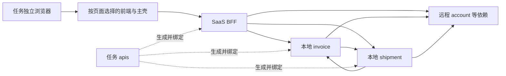

# 真实试点仓库核对

检查日期：2026-09-20。只读检查源码、配置结构和已有工具链文件；未启动服务、执行测试、生成代码、安装依赖、访问业务系统或修改试点仓库。以下启动与绑定方式是候选配方，尚未运行验证。

## 仓库快照与角色

| 用户指定仓库 | 当前 HEAD | 实际角色 |
| --- | --- | --- |
| `/Users/leonz3n/Workspace/adber/front-monorepo` | `c2a02032` | 多个前端、BFF 及共享包；一次任务选择所需运行单元 |
| `/Users/leonz3n/Workspace/adber/invoice-service` | `a7fc823` | Go gRPC 主服务、独立 worker/调度器及一次性业务工具 |
| `/Users/leonz3n/Workspace/adber/apis` | `adaf4e96` | 协议及 Go/TS 生成产物，不是待启动服务 |
| `/Users/leonz3n/Workspace/adber/shipment-service` | `b920dfa6` | Go 运单服务及可按功能选取的后台进程 |

invoice 当前已有 `cmd/li-reconcile/main.go` 未提交修改；本次未触碰。其他三个仓库检查时干净。新 worktree 默认从指定 Git 引用创建，不自动包含主检出目录中的未提交修改。

上级仓库说明中的 Go 1.24 与统一 apis submodule 描述已落后于当前代码。invoice、shipment 及 apis 生成模块均声明 Go 1.26.0；当前四仓 Git index 未发现 mode 160000 子模块记录。

## 推荐试点拓扑（待选定具体业务用例）

该图表示已发现的依赖关系，不代表所有依赖均在启动时访问，也不代表只启动这些服务就已能完成登录或所有业务流程。invoice 与 shipment 的双向依赖意味着启动编排需要支持一组服务先开始监听，再执行联通检查，不能简单对全部调用依赖做拓扑排序。

## front-monorepo

### 启动单元与变量

- 根目录 `dev` 会启动多个应用；任务配方应选择明确的包。SaaS React 前端可用 `pnpm --filter @shipber/saas-web dev`，legacy 主壳可用 `pnpm --filter saas-legacy-web dev`，BFF 可用 `pnpm --filter @shipber/saas-bff start:dev`。这些为源码中的现有入口，尚未运行。
- Node 要求 `>=20.10.0`、pnpm 固定为 `10.0.0`：[根 package.json](/Users/leonz3n/Workspace/adber/front-monorepo/package.json:5)。BFF 在启动前构建 graphql-server 与 grpc-clients：[BFF package.json](/Users/leonz3n/Workspace/adber/front-monorepo/apps/saas-bff/package.json:9)。
- 前端监听端口为 `VITE_PORT`，请求地址为 `VITE_BFF_URL`：[Vite 配置](/Users/leonz3n/Workspace/adber/front-monorepo/apps/saas-web/vite.config.ts:105)。legacy 主壳还通过 `VITE_SUB_TMS_URL`、`VITE_SUB_USER_CENTER_URL`、`VITE_SUB_SAAS_URL` 选择子应用：[微前端配置](/Users/leonz3n/Workspace/adber/front-monorepo/apps/saas-legacy-web/src/qiankun/config.ts:38)。
- BFF 监听 `PORT`：[main.ts](/Users/leonz3n/Workspace/adber/front-monorepo/apps/saas-bff/src/main.ts:16)。配置文件选择依赖 `NODE_ENV`，读取 `.env.${NODE_ENV}` 与 `.env`：[app.module.ts](/Users/leonz3n/Workspace/adber/front-monorepo/apps/saas-bff/src/app.module.ts:31)。启动配方应显式确定环境，不把脚本名 `start:local` 当作 NODE_ENV 已正确设置的证据。
- BFF 下游优先读取 `*_GRPC_URL`，再使用 `*_SERVICE_HOST/PORT`，最后回退服务名：[grpc.utils.ts](/Users/leonz3n/Workspace/adber/front-monorepo/packages/grpc-clients/src/grpc.utils.ts:18)。当前任务应绑定 `INVOICE_SERVICE_V1_GRPC_URL` 和 `SHIPMENT_SERVICE_V1_GRPC_URL`，只改 HOST/PORT 可能被已有 URL 覆盖。
- 根 `.vscode` 只有编辑器设置和扩展清单，主要启动信息要从 package scripts 与各应用配置中提取。

### 浏览器与登录边界

- SaaS 前端的 localStorage BFF 地址覆盖优先于 `VITE_BFF_URL`：[client.ts](/Users/leonz3n/Workspace/adber/front-monorepo/apps/saas-web/src/graphql/client.ts:153)。保留任务浏览器状态时必须识别这个覆盖，否则新服务端口生效后页面仍可能调用旧地址。应只处理应用已知的地址覆盖项，保留用户登录状态。
- BFF 鉴权除 JWT 外还调用远程 account 服务：[auth.guard.ts](/Users/leonz3n/Workspace/adber/front-monorepo/apps/saas-bff/src/auth/auth.guard.ts:63)。需要当前环境匹配的公钥文件及 account 服务可达性。
- BFF 租户中间件取 Origin/Referer 的 hostname 首段：[tenant.middleware.ts](/Users/leonz3n/Workspace/adber/front-monorepo/apps/saas-bff/src/common/middlewares/tenant.middleware.ts:10)。前端即使发送 Tenant 头，也不能据此认定该中间件会使用它；localhost 访问方式和租户路由须在试点中核对。
- BFF 的 `/v1/auth/login` 仍有 TODO，不能当完整独立登录服务使用：[auth.controller.ts](/Users/leonz3n/Workspace/adber/front-monorepo/apps/saas-bff/src/auth/auth.controller.ts:14)。前端主壳及现有登录依赖应按具体页面选择。
- `/health` 当前只报告应用 up，不检测所有下游：[health.controller.ts](/Users/leonz3n/Workspace/adber/front-monorepo/apps/saas-bff/src/health/health.controller.ts:13)。

## invoice-service

- 候选启动：任务仓库根目录执行 `go run ./cmd/server -conf ./configs/config.yaml`。
- 显式选择单个默认配置文件。入口加载 cwd 下 `.env` 和 Kratos env/file source，进程环境优先于 godotenv 文件值；环境变量通过 YAML 占位符绑定字段：[main.go](/Users/leonz3n/Workspace/adber/invoice-service/cmd/server/main.go:35)。
- 主要绑定：`GRPC_ADDR`、`DB_*`、`REDIS_ADDR/DB/USERNAME/PASSWORD`、`AMQP_URL`、`SHIPMENT_SERVICE_V1_ENDPOINT`，以及远程 `FILE/FINANCE/PLAN_SUBSCRIPTION/ACCOUNT/MESSAGE_SERVICE_V1_ENDPOINT`：[默认配置](/Users/leonz3n/Workspace/adber/invoice-service/configs/config.yaml:5)。
- 主入口仅装配 gRPC；默认 YAML 声明 HTTP 配置不代表主进程监听 HTTP。使用标准 gRPC health 作为基本存活探测，业务依赖另外验证：[main.go](/Users/leonz3n/Workspace/adber/invoice-service/cmd/server/main.go:51)。
- `cmd/job`、`cmd/scheduler` 是独立运行单元；`cmd/task`、`cmd/admin` 等可能直接执行业务操作，不能把所有入口都自动启动。
- `make build` 调用的脚本包含 Linux 编译、镜像推送与部署回调，应从本地启动配方中排除：[Makefile](/Users/leonz3n/Workspace/adber/invoice-service/Makefile:46)、[打包脚本](/Users/leonz3n/Workspace/adber/invoice-service/build/local-package.sh:141)。

`.vscode` 存在旧配方：`test.yaml` 用 `SHIPMENT_SERVICE_ENDPOINT`，默认 `config.yaml` 用 `SHIPMENT_SERVICE_V1_ENDPOINT`，launch 中还出现 `SHIPMENT_SERVICE_V1`。部分 reconcile 配置没有 env 占位符，不能通过随意添加同名环境变量覆盖。旧 `data.database.source` 非空时优先于拆分 DB 参数：[test.yaml](/Users/leonz3n/Workspace/adber/invoice-service/configs/test.yaml:46)、[launch.json](/Users/leonz3n/Workspace/adber/invoice-service/.vscode/launch.json:204)、[data.go](/Users/leonz3n/Workspace/adber/invoice-service/internal/data/data.go:536)。因此导入器必须核对配置文件与变量实际读取点。

异步队列名在 worker 与生产者中硬编码：[asynq.go](/Users/leonz3n/Workspace/adber/invoice-service/internal/server/asynq.go:46)、[customershipmentinvoice.go](/Users/leonz3n/Workspace/adber/invoice-service/internal/biz/customershipmentinvoice.go:228)。共享 Redis DB 时，本地产生的任务可能被远程 worker 取走，反之亦然。RabbitMQ 也需要按实际路由和 vhost 核对。选择任务专用 Redis DB/vhost 是候选配置方案，但需要生产者与消费者一起使用，且不能自动解决共享数据库或远程生产者。

另一个启动核对项：普通 Redis client 未传 `REDIS_USERNAME`，Asynq 独立 client 有传。若目标 Redis 依赖 ACL 用户名，需要修正业务适配：[data.go](/Users/leonz3n/Workspace/adber/invoice-service/internal/data/data.go:296)。本轮未改动。

## shipment-service

- 候选启动同样为 `go run ./cmd/server -conf ./configs/config.yaml`，cwd 为任务仓库根目录。
- 明确传单文件；加载整个 configs 目录会混入旧 `test.yaml`，旧数据库 source 可能绕过 DB_HOST 等拆分变量：[main.go](/Users/leonz3n/Workspace/adber/shipment-service/cmd/server/main.go:76)、[data.go](/Users/leonz3n/Workspace/adber/shipment-service/internal/data/data.go:317)。
- 端口为 `HTTP_ADDR`、`GRPC_ADDR`；本地 invoice 地址为 `INVOICE_SERVICE_ENDPOINT`，与 invoice 侧变量命名不对称：[默认配置](/Users/leonz3n/Workspace/adber/shipment-service/configs/config.yaml:56)。
- 其他依赖包括 account、file、finance、message、多个 carrier、平台和订阅服务；默认多个地址为集群 DNS。需要用选定环境的可达入口替换，或建立后续集群连接方案。
- HTTP 未注册显式 `/health`；可用 Kratos 默认 gRPC health 做存活探测，业务依赖单独验证：[http.go](/Users/leonz3n/Workspace/adber/shipment-service/internal/server/http.go:14)。
- `DTM_SERVER` 控制出站访问，`DTM_WORKFLOW_GRPC_CALLBACK` 控制 DTM 回调地址。涉及工作流时，必须使远程 DTM 能回到当前任务：[dtmworkflow.go](/Users/leonz3n/Workspace/adber/shipment-service/internal/server/dtmworkflow.go:82)、[transaction.go](/Users/leonz3n/Workspace/adber/shipment-service/internal/data/transaction.go:30)。
- Asynq 队列名同样存在硬编码：[asynq.go](/Users/leonz3n/Workspace/adber/shipment-service/internal/server/asynq.go:54)。后台进程应按用例选择，不能默认全启动。
- `WORK_ID` 用于 Snowflake 节点编号，缺省随机选择有限范围；多任务及远程实例共享数据时还需统筹此类实例标识：[snowflake.go](/Users/leonz3n/Workspace/adber/shipment-service/internal/pkg/uniqueid/snowflake.go:35)。
- `.vscode` 有 `DB_TLS_ENABLE`，默认文件实际使用 `DB_TLS_ENABLED`。启动配方必须按读取点校验：[launch.json](/Users/leonz3n/Workspace/adber/shipment-service/.vscode/launch.json:23)、[config.yaml](/Users/leonz3n/Workspace/adber/shipment-service/configs/config.yaml:24)。
- 当前入口初始化 OTLP traces/metrics/logs，运行检查应能解释采集器连接错误；没有发现仓库统一关闭开关。此次未发现 Java/JNI 运行依赖，不应要求配置 JAVA_HOME。

## apis：任务内生成与依赖绑定

当前消费者使用发布包：invoice 的 Go module 为 `v0.0.69`，shipment 为 `v0.0.103`，SaaS BFF 的 `@shipber/proto` 为 `0.0.108`。版本不能跨语言直接比较，也不能假定切换到同一最新本地生成物后全部兼容。

建议区分两种运行模式：

1. 不涉及协议修改：保留各消费者原有发布依赖。
2. 涉及协议修改：在任务 apis worktree 生成代码，绑定选定消费者，检查编译与实际解析路径，再启动。

现有仓库已支持本地联调：[apis README](/Users/leonz3n/Workspace/adber/apis/README.md:105)。Go 可为每个服务生成单独的任务 `go.work`，分别纳入该服务和当前任务 `apis/gen/go`，并通过 `GOWORK` 指定；这避免将多个服务同时置入一个工作区而无意合并依赖选择。该方式仍需实际编译确认，不自动执行 `go work sync`。

BFF 使用已有 `proto:link-local`，指向任务 `apis/gen/ts`，可通过 `--app` 选择消费者。脚本只调整任务内 node_modules 的链接和标记，不修改发布依赖声明或锁文件，Windows 使用 junction：[link-local-proto.mjs](/Users/leonz3n/Workspace/adber/front-monorepo/tools/link-local-proto.mjs:56)。安装依赖后需要重新核验绑定；生成包也必须具备自己的运行依赖。

生成过程还有后处理与工具链要求：

- Go 生成后必须运行仓库后处理，不是单独执行 `buf generate` 即完成：[Makefile](/Users/leonz3n/Workspace/adber/apis/Makefile:48)。
- TS 使用本地 ES 插件，Windows 有 PowerShell wrapper。Windows ARM64 的 protoc 安装路径当前明确不支持，Windows x64 也未实际验证：[install-buf-plugins.ps1](/Users/leonz3n/Workspace/adber/apis/scripts/install-buf-plugins.ps1:120)。
- shipment 与 front 留有旧 Buf 生成配置，不对应当前主要 import 路径；不能仅因发现 Buf 文件就自动执行旧流程。
- 生成目录及多数产物被忽略，新 worktree 不自带原工作目录的生成物和依赖。

## 对 PiDock 设计的修正建议

1. 任务准备状态需要区分：代码就绪、工具链就绪、依赖已安装、生成物已更新、本地绑定有效、运行环境可达。
2. 把仓库、运行服务、生成步骤、依赖绑定分开建模；可视化同时显示代码依赖与运行时调用关系。
3. 导入配置时校验变量读取点，显示“已识别”“未生效”“仅本机”“一次性命令”等具体结果。
4. 为每个子进程传独立 env，不修改应用进程的全局环境；保持任务地址、GOWORK 等设置不串入其他任务。
5. 运行实例管理除端口外还需容纳 WORK_ID、消息资源范围等显式绑定；不声称能够通用地自动隔离所有业务资源。
6. 验证结果分为进程存活、依赖可达和业务用例通过。协议生成版本、未提交代码状态、浏览器实际目标地址都应纳入结果归属。
7. 用户已接受首个验收从同步请求链路开始，再独立验证异步 worker 和远程回调。具体页面链路见 [对账单详情用例](pilot-synchronous-query.md)。

## 首个用例与执行准备

首个用例采用 SaaS 订阅消费流水中的对账单详情同步查询，验证浏览器 → 本地 BFF → 本地 invoice/shipment。普通账单列表仍走旧 REST，不作为这条本地链路的验收。异步 worker 和 DTM 工作流保留独立里程碑，不能用同步查询结果替代。

具体使用哪个非生产环境、登录账号和测试数据在执行前确定；本报告不包含这些值。
